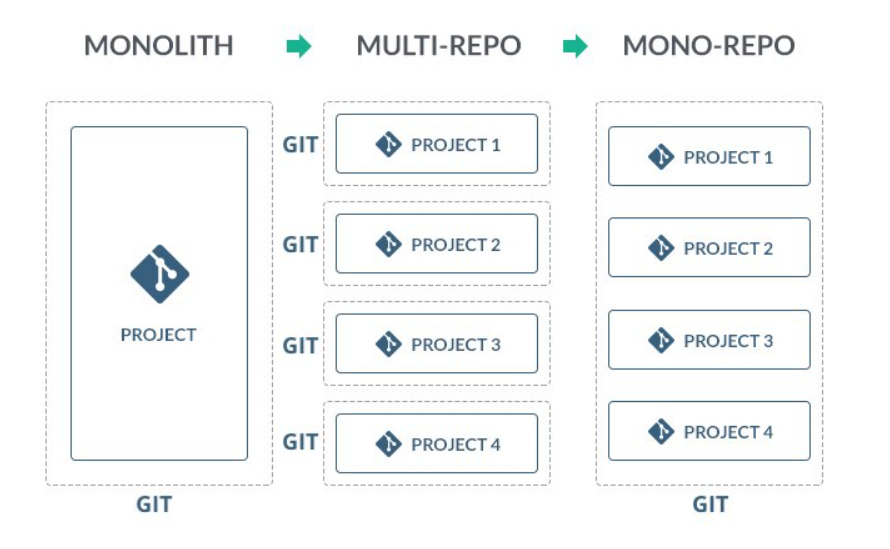

# Clean Arch Base
Estrutura base de pastas pensada em uma arquitetura com um design de software nos moldes do Clean Code.
Esse projeto foi pensado para ser utilizado por um sistema com o conceito de `client-side`/`server-side`.

Essa é uma arquitetura simplificada para projetos pequenos a medios, projetos grandes podem ser escalados mas vão requerer alguma arquitetura adicional.

## Monorepo
A ideia é que a equipe consiga gerenciar o projeto todo de forma facil. Como estamos pensando numa arquitetura `cliente`/`servidor` o projeto é dividido em 2 grandes seções `Backend`/`Frontend`.
Em varios projetos acabamos utilizando um repositório para cada uma das seções.

Para equipes menores ou que precisam de códigos mais integrados acaba sendo mais complexo gerenciar N repositórios. A ideia do monorepo é ter num lugar tudo q é necessário para o sistema subir.
Diferente de um projeto monolitico ainda temos N projetos porém em apenas 1 repositório de código.

## Project Naming conventions
- **filename**: follows the case of the main exported item
- **component name**: PascalCase
- **Classes name**: PascalCase
- **Interfaces name**: PascalCase with `I` prefix. ex: `IClient`
- **folders name**: kebab-case
- **global constants**: SCREAMING_SNAKE_CASE (except local constants used like variables)
- **Utility functions**: camelCase
- **local variables**: camelCase
- **local constants**: camelCase
- **boolean**: Prefix this variables with `is`, `has`, or `should` to denote boolean values.

Veja os docs especificos para o [back](./backend/README.md)

Veja os docs especificos para o [Front](./frontend/README.md)