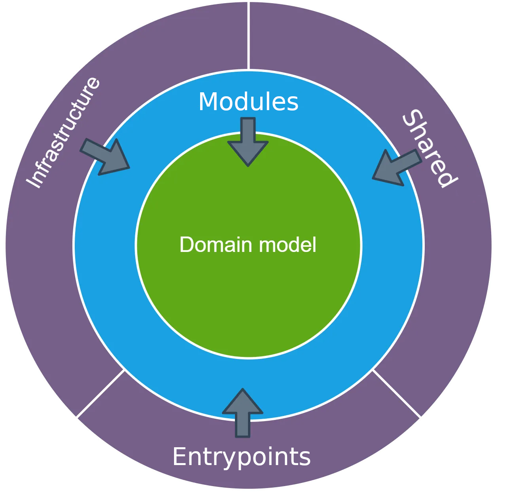

[voltar](../README.md)
# Clean Arch Base Backend
Estrutura base de pastas pensada em uma arquitetura com um design de software nos moldes do Clean Code
Esta é uma simplificação da Onion Arch, descartando todas as partes que aumentavam a complexidade do projeto.

Essa organização foi pensada para `Typescript` mas pode ser reutilizada para outros tipos de linguagens interpretadas.

## Representação grafica da arquitetura


## estrutura de pastas

```bash
─── src
    ├── app
    │   ├── config
    │   └── entrypoints
    ├── domain
    ├── infraestructure
    │   ├── repository
    │   └── singleton
    ├── modules
    └── shared
```
- src: por default todo o código do projeto deve estar nessa pasta
- **App**
  -  **config**: toda a configuração da aplicação como variaveis de ambiente e itens q devem ser controlados globalmente;

  -  **entrypoints**: entradas da aplicação códigos root de inicialização que devem ser chamados no index;


-  **Domain**: Itens q pertencen ao dominio da aplicação, de preferencia Interfaces e classes abstratas que representam dados ou iterações do dominio. O desejavel é que toda a aplicação aponte para essa pasta e nada desta pasta aponte para fora.


-  **Infraestructure**: Lida com preocupações externas, como bancos de dados, sistemas de arquivos ou serviços externos.


-  **Modules**:Onde a execução do sistema de fato ocorre, toda implementação para que o dominio funcione na tecnologia escolhida deve estar aqui. A ideia é que o modulo execute uma tarefa específica e o entrypoint faça uma chamada a esses módulos de forma que a saida esperada seja gerada. Também podemos utilizar o conceito de módulos utilitarios q são usados por outros módulos de forma a otimizar implementações.


-  **Shared**: Todo código q deve ser compartilhado entre os módulos, preferencialmente classes utilitarias que não se encaixam em um módulo específico.